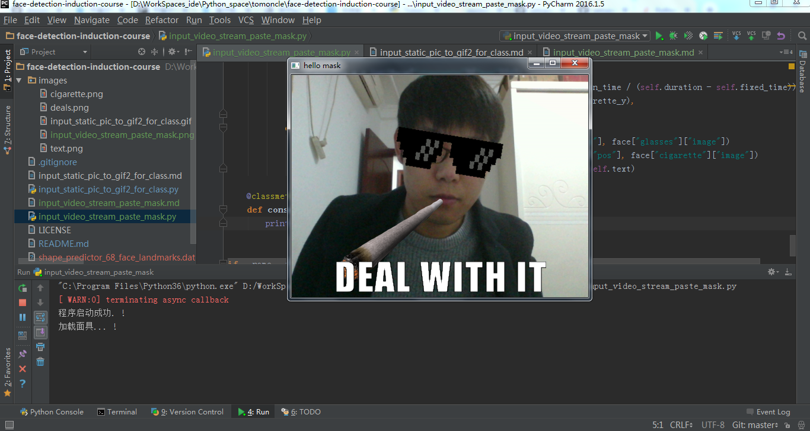

# 获取摄像头视频，实时控制多张人脸戴墨镜和叼烟卷



## 实现流程

> 从摄像头获取视频流，并转换为一帧一帧的图像，然后将图像信息传递给opencv这个工具库处理，返回灰度图像（就像你使用本地静态图片一样）

> 程序启动后，根据监听器信息，使用一个while循环，不断的加载视频图像，然后返回给opencv工具呈现图像信息。

> 创建一个键盘事件监听，按下"d"键，则开始执行面部匹配，并进行面具加载（这个过程是动态的，你可以随时移动）。

> 面部匹配使用Dlib中的人脸检测算法来查看是否有人脸存在。如果有，它将为每个人脸创建一个结束位置，眼镜和烟卷会移动到那里结束。

> 然后我们需要缩放和旋转我们的眼镜以适合每个人的脸。我们将使用从Dlib的68点模型返回的点集来找到眼睛和嘴巴的中心，并为它们之间的空间旋转。

> 在我们实时获取眼镜和烟卷的最终位置后，眼镜和烟卷从屏幕顶部进入，开始匹配你的眼镜和嘴巴。

> 假如没有人脸，程序会直接返回你的视频信息，不会有面具移动的效果。

> 默认一个周期是4秒钟。然后你可以通过"d"键再次检测。

> 程序退出使用"q"键。

##### 这里我讲这个功能抽象成一个面具加载服务，请跟随我的代码一窥究竟吧。

* 1.导入对应的工具包
```python
from time import sleep

import cv2
import numpy as np
from PIL import Image
from imutils import face_utils, resize

try:
    from dlib import get_frontal_face_detector, shape_predictor
except ImportError:
    raise
```

* 创建面具加载服务类`DynamicStreamMaskService`及其对应的初始化属性:
```python
class DynamicStreamMaskService(object):
    """
    动态黏贴面具服务
    """

    def __init__(self, saved=False):
        self.saved = saved  # 是否保存图片
        self.listener = True  # 启动参数
        self.video_capture = cv2.VideoCapture(0)  # 调用本地摄像头
        self.doing = False  # 是否进行面部面具
        self.speed = 0.1  # 面具移动速度
        self.detector = get_frontal_face_detector()  # 面部识别器
        self.predictor = shape_predictor("shape_predictor_68_face_landmarks.dat")  # 面部分析器
        self.fps = 4  # 面具存在时间基础时间
        self.animation_time = 0  # 动画周期初始值
        self.duration = self.fps * 4  # 动画周期最大值
        self.fixed_time = 4  # 画图之后，停留时间
        self.max_width = 500  # 图像大小
        self.deal, self.text, self.cigarette = None, None, None  # 面具对象

```

* 按照上面介绍，我们先实现读取视频流转换图片的函数：
```python
def read_data(self):
    """
    从摄像头获取视频流，并转换为一帧一帧的图像
    :return: 返回一帧一帧的图像信息
    """
    _, data = self.video_capture.read()
    return data
```

* 接下来我们实现人脸定位函数，及眼镜和烟卷的定位:
```python
def get_glasses_info(self, face_shape, face_width):
    """
    获取当前面部的眼镜信息
    :param face_shape:
    :param face_width:
    :return:
    """
    left_eye = face_shape[36:42]
    right_eye = face_shape[42:48]

    left_eye_center = left_eye.mean(axis=0).astype("int")
    right_eye_center = right_eye.mean(axis=0).astype("int")

    y = left_eye_center[1] - right_eye_center[1]
    x = left_eye_center[0] - right_eye_center[0]
    eye_angle = np.rad2deg(np.arctan2(y, x))

    deal = self.deal.resize(
        (face_width, int(face_width * self.deal.size[1] / self.deal.size[0])),
        resample=Image.LANCZOS)

    deal = deal.rotate(eye_angle, expand=True)
    deal = deal.transpose(Image.FLIP_TOP_BOTTOM)

    left_eye_x = left_eye[0, 0] - face_width // 4
    left_eye_y = left_eye[0, 1] - face_width // 6

    return {"image": deal, "pos": (left_eye_x, left_eye_y)}

def get_cigarette_info(self, face_shape, face_width):
    """
    获取当前面部的烟卷信息
    :param face_shape:
    :param face_width:
    :return:
    """
    mouth = face_shape[49:68]
    mouth_center = mouth.mean(axis=0).astype("int")
    cigarette = self.cigarette.resize(
        (face_width, int(face_width * self.cigarette.size[1] / self.cigarette.size[0])),
        resample=Image.LANCZOS)
    x = mouth[0, 0] - face_width + int(16 * face_width / self.cigarette.size[0])
    y = mouth_center[1]
    return {"image": cigarette, "pos": (x, y)}

def orientation(self, rects, img_gray):
    """
    人脸定位
    :return:
    """
    faces = []
    for rect in rects:
        face = {}
        face_shades_width = rect.right() - rect.left()
        predictor_shape = self.predictor(img_gray, rect)
        face_shape = face_utils.shape_to_np(predictor_shape)
        face['cigarette'] = self.get_cigarette_info(face_shape, face_shades_width)
        face['glasses'] = self.get_glasses_info(face_shape, face_shades_width)

        faces.append(face)

    return faces

```

* 刚才我们提到了键盘监听事件，这里我们实现一下这个函数：
```python
def listener_keys(self):
    """
    设置键盘监听事件
    :return:
    """
    key = cv2.waitKey(1) & 0xFF
    if key == ord("q"):
        self.listener = False
        self.console("程序退出")
        sleep(1)
        self.exit()

    if key == ord("d"):
        self.doing = not self.doing

```

* 接下来我们来实现加载面具信息的函数：
```python
def init_mask(self):
    """
    加载面具
    :return:
    """
    self.console("加载面具...")
    self.deal, self.text, self.cigarette = (
        Image.open(x) for x in ["images/deals.png", "images/text.png", "images/cigarette.png"]
    )
```

* 上面基本的功能都实现了，我们该实现画图函数了，这个函数原理和之前我写的那篇"识别任意存在人脸的照片，动态生成戴墨镜和叼烟卷的动图"实现是一样的，这里我就不赘述了，可以去github或Python中文社区公众号查看。
```python
def drawing(self, draw_img, faces):
    """
    画图
    :param draw_img:
    :param faces:
    :return:
    """
    for face in faces:
        if self.animation_time < self.duration - self.fixed_time:
            current_x = int(face["glasses"]["pos"][0])
            current_y = int(face["glasses"]["pos"][1] * self.animation_time / (self.duration - self.fixed_time))
            draw_img.paste(face["glasses"]["image"], (current_x, current_y), face["glasses"]["image"])

            cigarette_x = int(face["cigarette"]["pos"][0])
            cigarette_y = int(face["cigarette"]["pos"][1] * self.animation_time / (self.duration - self.fixed_time))
            draw_img.paste(face["cigarette"]["image"], (cigarette_x, cigarette_y),
                           face["cigarette"]["image"])
        else:
            draw_img.paste(face["glasses"]["image"], face["glasses"]["pos"], face["glasses"]["image"])
            draw_img.paste(face["cigarette"]["image"], face["cigarette"]["pos"], face["cigarette"]["image"])
            draw_img.paste(self.text, (75, draw_img.height // 2 + 128), self.text)

```

* 既然是一个服务类，那该有启动与退出函数吧，最后我们来写一下吧。

> 简单介绍一下这个`start()`函数, 启动后根据初始化监听信息，不断监听视频流，并将流信息通过opencv转换成图像展示出来。
> 并且调用按键监听函数，不断的监听你是否按下"d"键进行面具加载，如果监听成功，则进行图像人脸检测，并移动面具，
> 并持续一个周期的时间结束，面具此时会根据你的面部移动而移动。最终呈现文章顶部图片的效果.

```python
def start(self):
    """
    启动程序
    :return:
    """
    self.console("程序启动成功.")
    self.init_mask()
    while self.listener:
        frame = self.read_data()
        frame = resize(frame, width=self.max_width)
        img_gray = cv2.cvtColor(frame, cv2.COLOR_BGR2GRAY)
        rects = self.detector(img_gray, 0)
        faces = self.orientation(rects, img_gray)
        draw_img = Image.fromarray(cv2.cvtColor(frame, cv2.COLOR_BGR2RGB))
        if self.doing:
            self.drawing(draw_img, faces)
            self.animation_time += self.speed
            self.save_data(draw_img)
            if self.animation_time > self.duration:
                self.doing = False
                self.animation_time = 0
            else:
                frame = cv2.cvtColor(np.asarray(draw_img), cv2.COLOR_RGB2BGR)
        cv2.imshow("hello mask", frame)
        self.listener_keys()

def exit(self):
    """
    程序退出
    :return:
    """
    self.video_capture.release()
    cv2.destroyAllWindows()
```

* 最后，让我们试试：
```python
if __name__ == '__main__':
    ms = DynamicStreamMaskService()
    ms.start()

```

* 写到这里，这个小功能就已经实现了，大家不妨事来使用一下.
* 获取完整代码：https://github.com/tomoncle/face-detection-induction-course/blob/master/input_video_stream_paste_mask.py

## 写在最后
* 关注 https://github.com/tomoncle/face-detection-induction-course 这个仓库，不定时更新更多的人脸识别小示例。
* 其他文章（识别任意存在人脸的照片，动态生成戴墨镜和叼烟卷的动图），一个临时测试的地址: https://liyuanjun.cn/gifmask 或 https://tomoncle.com/gifmask
* [模型下载](https://github.com/davisking/dlib-models/raw/master/shape_predictor_68_face_landmarks.dat.bz2)
